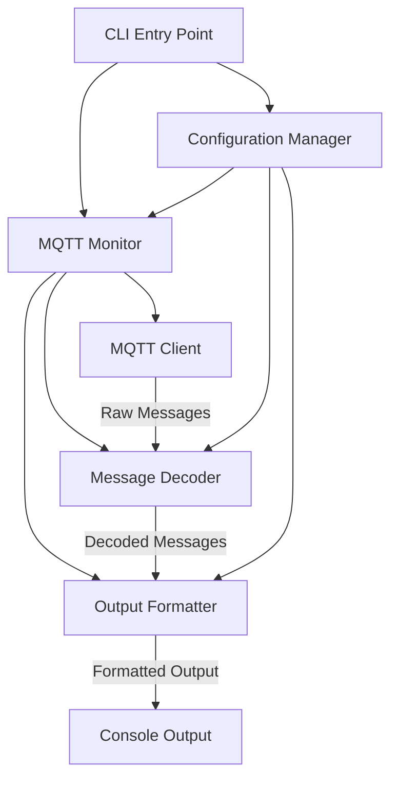

# Design Document: Meshtastic MQTT Monitor

## Overview

The Meshtastic MQTT Monitor is a Python-based command-line application that subscribes to MQTT topics, receives Meshtastic protobuf-encoded messages, decrypts them when necessary, and displays formatted, color-coded output for debugging purposes. The application is designed to be highly configurable through both YAML configuration files and command-line arguments.

### Key Design Goals

- **Modularity**: Separate concerns into distinct components (MQTT client, message decoder, output formatter, configuration manager)
- **Extensibility**: Easy to add support for new packet types and display formats
- **User-Friendly**: Clear output with configurable colors and highlighting
- **Robust**: Graceful error handling and connection recovery
- **Maintainable**: Well-documented code with automated dependency management

## Architecture

### High-Level Architecture



### Component Responsibilities

1. **CLI Entry Point** (`main.py`)
   - Parse command-line arguments
   - Initialize configuration manager
   - Start the monitor application
   - Handle graceful shutdown

2. **Configuration Manager** (`config.py`)
   - Load and validate YAML configuration
   - Merge command-line arguments with config file
   - Provide configuration access to other components
   - Validate configuration schema

3. **MQTT Client** (`mqtt_client.py`)
   - Connect to MQTT broker with configured credentials
   - Subscribe to specified topics/channels
   - Handle connection errors and reconnection
   - Pass received messages to the decoder

4. **Message Decoder** (`decoder.py`)
   - Decode Meshtastic protobuf messages
   - Handle encryption/decryption using channel keys
   - Identify packet types
   - Extract relevant fields from messages

5. **Output Formatter** (`formatter.py`)
   - Format decoded messages for display
   - Apply color coding based on packet type
   - Apply keyword highlighting
   - Generate consistent output format

## Components and Interfaces

### Configuration Manager

**File**: `src/config.py`

**Responsibilities**:
- Load YAML configuration from file
- Create default configuration file if missing (with defaults: host=mqtt.thevillages.com, username=meshdev, password=large4cats)
- Parse command-line arguments
- Merge configurations (CLI overrides file)
- Validate configuration schema
- Provide typed configuration access

**Key Classes**:

```python
class MQTTConfig:
    host: str
    port: int
    username: Optional[str]
    password: Optional[str]
    use_tls: bool
    ca_cert: Optional[str]

class ChannelConfig:
    name: str
    encryption_key: Optional[str]

class DisplayFieldConfig:
    packet_type: str
    fields: List[str]

class ColorConfig:
    packet_type_colors: Dict[str, str]  # packet_type -> ANSI color code
    keyword_highlights: Dict[str, str]  # keyword -> ANSI color code

class KeywordConfig:
    keyword: str
    case_sensitive: bool
    color: str

class MonitorConfig:
    mqtt: MQTTConfig
    topic: str
    channels: Optional[List[str]]
    channel_keys: Dict[str, str]  # channel_name -> encryption_key
    display_fields: Dict[str, List[str]]  # packet_type -> field_list
    colors: ColorConfig
    keywords: List[KeywordConfig]

class ConfigManager:
    def load_config(file_path: str) -> MonitorConfig
    def merge_cli_args(config: MonitorConfig, args: argparse.Namespace) -> MonitorConfig
    def validate_config(config: MonitorConfig) -> bool
```

**Configuration File Structure** (`config.yaml`):

```yaml
version: "1.0"

mqtt:
  host: "mqtt.thevillages.com"  # Default host
  port: 1883
  username: "meshdev"  # Default username
  password: "large4cats"  # Default password
  use_tls: false
  ca_cert: null

monitoring:
  topic: "msh/US/2/e/#"
  channels: null  # null = all channels, or list specific channels
  
encryption:
  channels:
    - name: "LongFast"
      key: "AQ=="  # Base64 encoded key
    - name: "Primary"
      key: "1PG7OiApB3XvvX7g8kYzDYQD+CW+3Oi+Qs/LoIWh/gg="

display:
  fields:
    POSITION:
      - latitude
      - longitude
      - altitude
      - timestamp
    TEXT_MESSAGE_APP:
      - from
      - to
      - text
      - timestamp
    TELEMETRY_APP:
      - battery_level
      - voltage
      - temperature
      - timestamp
    NODEINFO_APP:
      - node_id
      - long_name
      - short_name
      - hardware_model

colors:
  packet_types:
    POSITION: "green"
    TEXT_MESSAGE_APP: "cyan"
    TELEMETRY_APP: "yellow"
    NODEINFO_APP: "blue"
    ROUTING_APP: "magenta"
    ADMIN_APP: "red"
    default: "white"
  
  keywords:
    - keyword: "emergency"
      case_sensitive: false
      color: "red_bold"
    - keyword: "alert"
      case_sensitive: false
      color: "yellow_bold"
```

### MQTT Client

**File**: `src/mqtt_client.py`

**Responsibilities**:
- Establish connection to MQTT broker
- Handle TLS/SSL connections
- Subscribe to topics with wildcards
- Receive messages and pass to callback
- Implement reconnection logic
- Handle connection errors gracefully

**Key Classes**:

```python
class MQTTClient:
    def __init__(self, config: MQTTConfig, on_message_callback: Callable)
    def connect(self) -> bool
    def subscribe(self, topic: str) -> bool
    def disconnect(self)
    def is_connected(self) -> bool
    def _on_connect(self, client, userdata, flags, rc)
    def _on_disconnect(self, client, userdata, rc)
    def _on_message(self, client, userdata, msg)
```

**Dependencies**:
- `paho-mqtt` library for MQTT protocol implementation

### Message Decoder

**File**: `src/decoder.py`

**Responsibilities**:
- Decode Meshtastic protobuf messages
- Decrypt encrypted messages using channel keys
- Identify packet type from protobuf structure
- Extract fields based on packet type
- Handle decoding errors gracefully

**Key Classes**:

```python
class DecodedMessage:
    packet_type: str
    channel: str
    from_node: str
    to_node: str
    timestamp: datetime
    fields: Dict[str, Any]
    raw_data: bytes
    decryption_success: bool

class MessageDecoder:
    def __init__(self, channel_keys: Dict[str, str])
    def decode(self, mqtt_topic: str, payload: bytes) -> DecodedMessage
    def _decrypt_payload(self, payload: bytes, channel: str) -> bytes
    def _identify_packet_type(self, decoded_proto: Any) -> str
    def _extract_fields(self, decoded_proto: Any, packet_type: str) -> Dict[str, Any]
```

**Dependencies**:
- `meshtastic` Python library for protobuf definitions
- `cryptography` library for decryption operations

**Protobuf Handling**:
- Use the official Meshtastic protobuf definitions from the `meshtastic` package
- Handle ServiceEnvelope and Data messages
- Support common packet types: POSITION, TEXT_MESSAGE_APP, TELEMETRY_APP, NODEINFO_APP, ROUTING_APP, etc.

### Output Formatter

**File**: `src/formatter.py`

**Responsibilities**:
- Format decoded messages for console output
- Apply ANSI color codes based on packet type
- Apply keyword highlighting
- Generate consistent timestamp formatting
- Handle field display based on configuration

**Key Classes**:

```python
class ANSIColors:
    # ANSI color code constants
    RESET: str
    RED: str
    GREEN: str
    YELLOW: str
    BLUE: str
    MAGENTA: str
    CYAN: str
    WHITE: str
    # Bold variants
    RED_BOLD: str
    # etc.

class OutputFormatter:
    def __init__(self, color_config: ColorConfig, display_fields: Dict[str, List[str]], keywords: List[KeywordConfig])
    def format_message(self, message: DecodedMessage) -> str
    def _apply_packet_type_color(self, text: str, packet_type: str) -> str
    def _apply_keyword_highlighting(self, text: str) -> str
    def _format_timestamp(self, timestamp: datetime) -> str
    def _format_fields(self, fields: Dict[str, Any], packet_type: str) -> str
```

**Output Format**:
```
[TIMESTAMP] [PACKET_TYPE] Channel: CHANNEL | From: NODE_ID | FIELD1: VALUE1 | FIELD2: VALUE2
```

Example:
```
[2024-11-15 14:23:45] [Location] Channel: LongFast | From: !a1b2c3d4 | Lat: 37.7749 | Lon: -122.4194 | Alt: 15m
[2024-11-15 14:23:46] [Message] Channel: LongFast | From: !a1b2c3d4 | To: !e5f6g7h8 | Text: "Hello World"
```

### MQTT Monitor (Main Application)

**File**: `src/monitor.py`

**Responsibilities**:
- Coordinate all components
- Initialize MQTT client, decoder, and formatter
- Handle application lifecycle
- Implement graceful shutdown
- Display startup information

**Key Classes**:

```python
class MeshtasticMonitor:
    def __init__(self, config: MonitorConfig)
    def start(self)
    def stop(self)
    def _on_message_received(self, topic: str, payload: bytes)
    def _display_startup_info(self)
```

### CLI Entry Point

**File**: `main.py`

**Responsibilities**:
- Define command-line argument parser
- Load configuration
- Initialize and start monitor
- Handle SIGINT/SIGTERM for graceful shutdown
- Display version information

**Command-Line Arguments**:
```
--config, -c: Path to config file (default: config.yaml)
--host: MQTT broker host
--port: MQTT broker port
--username: MQTT username
--password: MQTT password
--use-tls: Enable TLS
--topic: MQTT topic to monitor
--channels: Comma-separated list of channels
--version, -v: Display version information
--color-PACKET_TYPE: Override color for packet type (e.g., --color-POSITION green)
--highlight-KEYWORD: Add keyword highlight with color (e.g., --highlight-emergency red_bold)
```

## Data Models

### Meshtastic Protobuf Structure

The application works with the following key Meshtastic protobuf messages:

1. **ServiceEnvelope**: Top-level MQTT message wrapper
   - Contains encrypted or unencrypted Data message
   - Includes channel hash and gateway information

2. **Data**: Core message container
   - Contains portnum (packet type identifier)
   - Contains payload (actual message data)
   - Includes routing information (from, to)

3. **Position**: Location data
   - latitude_i, longitude_i (fixed-point integers)
   - altitude
   - time
   - precision_bits

4. **User**: Node information
   - id (node ID)
   - long_name
   - short_name
   - hardware_model

5. **Telemetry**: Device telemetry
   - battery_level
   - voltage
   - channel_utilization
   - air_util_tx

### Internal Data Flow

```
MQTT Message (bytes)
  ↓
ServiceEnvelope (protobuf)
  ↓
Decrypt (if encrypted)
  ↓
Data (protobuf)
  ↓
Identify portnum → Packet Type
  ↓
Decode payload → Specific Message Type
  ↓
Extract Fields → DecodedMessage
  ↓
Format → Colored Console Output
```

## Error Handling

### Connection Errors

- **MQTT Connection Failure**: Log error, attempt reconnection with exponential backoff (1s, 2s, 4s, 8s, max 60s)
- **Authentication Failure**: Log error with clear message, do not retry automatically
- **Network Timeout**: Implement keep-alive and reconnect on timeout

### Decoding Errors

- **Invalid Protobuf**: Log warning, display raw message hex dump with [DECODE_ERROR] indicator
- **Decryption Failure**: Display message with [ENCRYPTED] indicator, show available metadata
- **Unknown Packet Type**: Display with [UNKNOWN] indicator, show portnum and raw payload

### Configuration Errors

- **Missing Config File**: Use default values where possible, warn about missing file
- **Invalid YAML**: Display clear error message with line number, exit gracefully
- **Invalid Encryption Key**: Warn about invalid key format, skip that channel's decryption
- **Invalid Color Code**: Warn and fall back to default color

### Runtime Errors

- **Keyboard Interrupt (Ctrl+C)**: Graceful shutdown with cleanup message
- **Unexpected Exception**: Log full traceback, attempt graceful shutdown

## Testing Strategy

### Unit Tests

**Test Coverage Areas**:
1. **Configuration Manager**
   - YAML parsing with valid/invalid inputs
   - CLI argument merging
   - Configuration validation
   - Default value handling

2. **Message Decoder**
   - Protobuf decoding for each packet type
   - Encryption/decryption with valid/invalid keys
   - Error handling for malformed messages
   - Field extraction accuracy

3. **Output Formatter**
   - Color code application
   - Keyword highlighting (case-sensitive/insensitive)
   - Field formatting for different data types
   - Timestamp formatting

4. **MQTT Client**
   - Connection handling (mock broker)
   - Topic subscription
   - Message callback invocation
   - Reconnection logic

### Integration Tests

1. **End-to-End Message Flow**
   - Mock MQTT broker publishing test messages
   - Verify correct decoding and output
   - Test with encrypted and unencrypted messages

2. **Configuration Integration**
   - Test CLI override of config file values
   - Test with various configuration combinations

### Manual Testing

1. **Real MQTT Broker Connection**
   - Connect to actual Meshtastic MQTT server
   - Verify message decoding with real traffic
   - Test with multiple channels and encryption keys

2. **Color Output Verification**
   - Verify colors display correctly in different terminals
   - Test keyword highlighting visibility

### Test Framework

- Use `pytest` for unit and integration tests
- Use `pytest-mock` for mocking MQTT connections
- Use `pytest-cov` for coverage reporting
- Target 80%+ code coverage for core components

## Dependencies

### Core Dependencies

- **Python**: 3.8+
- **paho-mqtt**: MQTT client library
- **meshtastic**: Official Meshtastic Python library (includes protobuf definitions)
- **cryptography**: For message decryption
- **PyYAML**: YAML configuration parsing
- **colorama**: Cross-platform ANSI color support

### Development Dependencies

- **pytest**: Testing framework
- **pytest-mock**: Mocking support
- **pytest-cov**: Coverage reporting
- **black**: Code formatting
- **flake8**: Linting
- **mypy**: Type checking

### Dependency Management

- Use `pyproject.toml` with Poetry or setuptools for dependency management
- Pin major versions, allow minor/patch updates
- Configure Renovate for automated dependency updates

## Deployment and Distribution

### Installation Methods

1. **pip install from PyPI** (future)
   ```bash
   pip install meshtastic-mqtt-monitor
   ```

2. **Install from source**
   ```bash
   git clone <repository>
   cd meshtastic-mqtt-monitor
   pip install -e .
   ```

3. **Docker container** (optional future enhancement)

### Configuration

- Default config file location: `./config.yaml`
- Example config file provided in repository
- Environment variable support for sensitive values (MQTT_PASSWORD, etc.)

## Security Considerations

1. **Credential Storage**
   - Warn users not to commit config files with credentials
   - Support environment variables for sensitive values
   - Add `config.yaml` to `.gitignore` template

2. **Encryption Keys**
   - Store keys in base64 format
   - Validate key format before use
   - Clear keys from memory when possible

3. **TLS/SSL**
   - Support TLS for MQTT connections
   - Allow custom CA certificate specification
   - Validate certificates by default

## Future Enhancements

1. **Message Filtering**
   - Filter by node ID
   - Filter by packet type
   - Time-based filtering

2. **Output Options**
   - JSON output format
   - Log to file
   - Structured logging

3. **Statistics**
   - Message count by type
   - Messages per channel
   - Decryption success rate

4. **Web Interface**
   - Real-time web dashboard
   - Message history
   - Interactive filtering

5. **Plugin System**
   - Custom packet type handlers
   - Custom output formatters
   - Custom message processors
